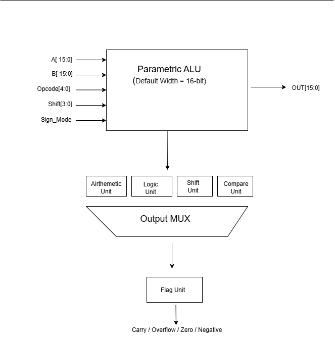
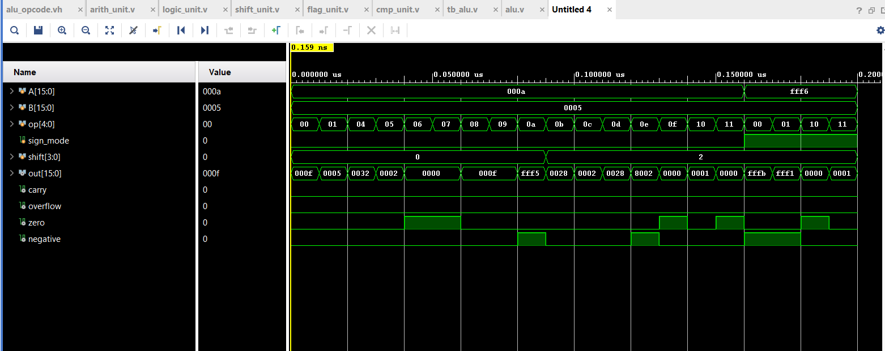
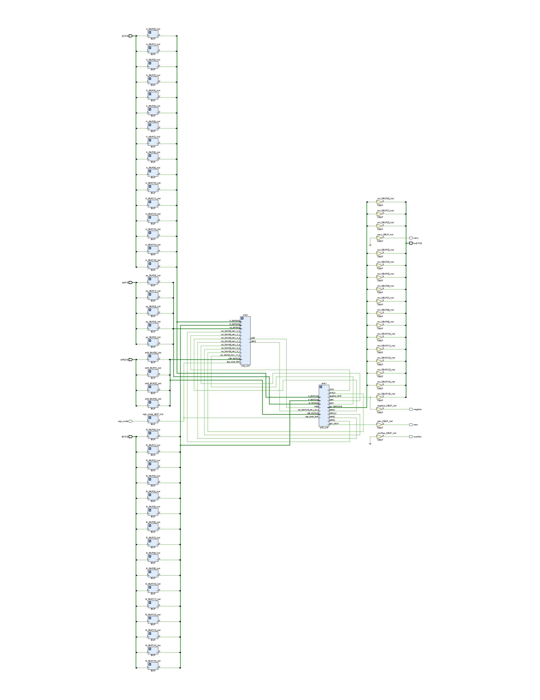

# 🚀 Parametric 16-bit ALU in Verilog HDL

A **modular and parameterized Arithmetic Logic Unit (ALU)** (Default Width 16-bit) designed using **Verilog HDL**. The project follows a hierarchical RTL design methodology by dividing the ALU into Arithmetic, Logic, Shift, Comparison, and Flag generation units.

The ALU supports multiple arithmetic, logical, shift/rotate, and comparison operations and has been functionally verified using **Xilinx Vivado XSim**.

---

# ✨ Features

- Parameterized ALU (Default Width = 16 bits)
- Modular RTL Design
- Signed and Unsigned Arithmetic
- Arithmetic Operations
- Logical Operations
- Shift & Rotate Operations
- Comparison Operations
- Status Flag Generation
- Synthesizable RTL
- Functional Simulation using Xilinx Vivado

---

# 🏗️ Block Diagram

The following figure illustrates the overall architecture of the Parametric ALU.

---

# 🧩 RTL Module Description

### Arithmetic Unit
Performs:

- Addition
- Subtraction
- Increment
- Decrement
- Multiplication
- Division
- Modulus

---

### Logic Unit

Performs:

- AND
- OR
- XOR
- NOT

---

### Shift Unit

Supports:

- Shift Left (SHL)
- Shift Right (SHR)
- Rotate Left (ROL)
- Rotate Right (ROR)

---

### Comparator Unit

Supports:

- Equal (EQ)
- Greater Than (GT)
- Less Than (LT)

---

### Flag Unit

Generates the following flags:

- Carry
- Overflow
- Zero
- Negative

---

# 📸 Functional Simulation

Simulation waveform generated using **Xilinx Vivado XSim**.

---

# 🔧 RTL Schematic

Synthesized RTL schematic generated using **Xilinx Vivado**.

📄 **High Resolution PDF**

[📥 View RTL Schematic (PDF)](schematic.pdf)

---

# 🛠️ Tools Used

- Verilog HDL
- Xilinx Vivado
- XSim Simulator
- Git
- GitHub

---

# 🧪 Verification

The design has been verified for:

- ✅ Arithmetic Operations
- ✅ Logical Operations
- ✅ Shift Operations
- ✅ Rotate Operations
- ✅ Comparison Operations
- ✅ Signed Arithmetic
- ✅ Zero Flag
- ✅ Carry Flag
- ✅ Overflow Flag
- ✅ Negative Flag

---

# 📌 Future Improvements

- Arithmetic Shift Operations
- Barrel Shifter
- Configurable Opcode Width
- FPGA Implementation
- UVM Verification Environment
- Randomized Testbench
- Functional Coverage

---

# 👨‍💻 Author

**Navneet Kumar Tiwari**

B.Tech in Electronics & Communication Engineering

Interested in:

- VLSI RTL Design
- FPGA Design
- Design Verification

---

## ⭐ If you found this project useful, please consider giving it a Star.
